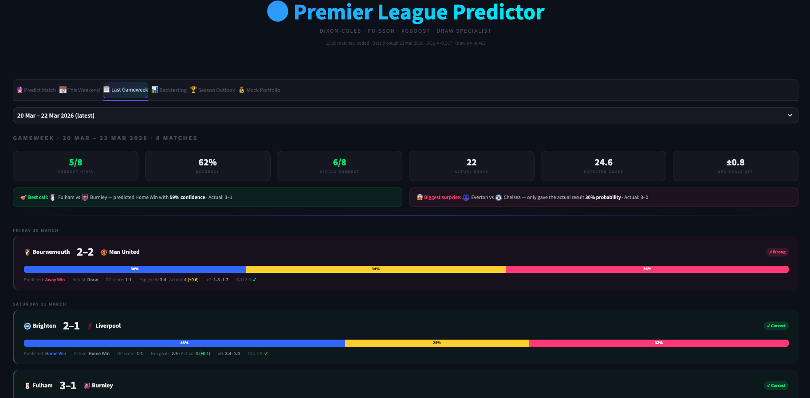
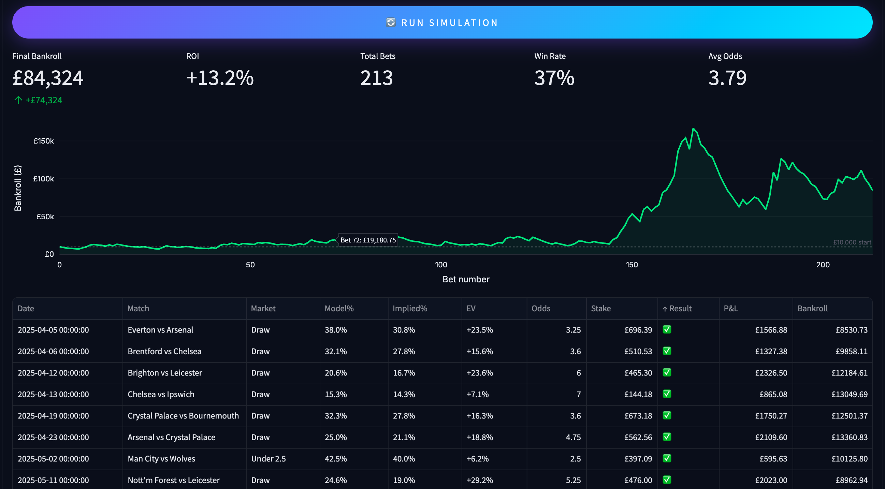

# Premier League Match Predictor

A full-stack football analytics app that predicts Premier League match outcomes using an ensemble of statistical and machine learning models, with a mock betting portfolio powered by live odds.

Built with Python, Streamlit, and Plotly.





## Features

**Match Prediction** — Select any two PL teams and get win/draw/loss probabilities, most likely scorelines, score matrix heatmap, goal distributions, recent form, and head-to-head history.

**Weekend Fixtures** — Auto-fetched from ESPN with probability bars, team badges, and expected goals for every upcoming match.

**Gameweek Review** — Compare model predictions against actual results with accuracy stats, best calls, and biggest surprises.

**Backtesting** — Evaluate model performance on historical data with configurable test windows, accuracy metrics, Brier scores, and calibration diagrams.

**Season Simulation** — Monte Carlo simulation (10,000 seasons) projecting title, top 4, and relegation probabilities for every team.

**Mock Portfolio** — Paper trading system with Kelly criterion sizing, auto-bet, live odds integration, value scanner, and bankroll tracking.

## Models

The prediction engine blends five models into a single probability estimate:

| Model | Role | Detail |
|-------|------|--------|
| **Dixon-Coles** | Primary (85%) | MLE-fitted attack/defence ratings with xG-based Poisson likelihood and low-score tau correction. 14-week exponential decay. |
| **XGBoost 3-Class** | Secondary (15%) | H/D/A classifier trained on ~40 rolling form features (goals, xG, Elo, venue stats, days rest). |
| **Draw Specialist DC** | Draw adjustment | Dixon-Coles variant with 3x draw-weighted training. Fitted rho ~ -0.46 vs standard -0.17. |
| **XGBoost Binary Draw** | Draw adjustment | Dedicated draw detector with xG convergence, Elo gap, and draw-prone interaction features. |
| **Poisson** | Baseline | Time-decayed multiplicative attack/defence ratings for comparison. |

**Ensemble pipeline:** DC (85%) + XGB (15%) -> Draw Specialist replaces draw probability at 35% weight -> H/A re-normalised.

## Mock Portfolio Performance

Backtested against historical Bet365 closing odds with strict train/test separation:

| Metric | Value |
|--------|-------|
| Starting bankroll | £10,000 |
| Final bankroll | £84,324 |
| Total bets | 213 |
| Win rate | 36.6% |
| ROI | +13.2% |
| Test window | 52 weeks |
| Markets | Draw + Under 2.5 only |

## Tech Stack

- **Python** — pandas, numpy, scipy, scikit-learn, xgboost
- **Streamlit** — interactive UI with custom CSS dark theme
- **Plotly** — charts, heatmaps, and visualisations
- **The Odds API** — live betting odds (free tier)
- **ESPN API** — fixtures and team badges
- **football-data.co.uk** — historical results and odds
- **Understat** — expected goals (xG) data

## Quick Start

```bash
git clone https://github.com/EoinHoustoun/Football_Match_Predictor.git
cd Football_Match_Predictor
bash run.sh
```

This installs dependencies and opens the app at `http://localhost:8501`.

**Requirements:** Python 3.9+. All data is fetched automatically on first run.

**Optional:** Add a free [The Odds API](https://the-odds-api.com/) key in the Portfolio tab settings for live odds integration.

## Project Structure

```
app.py         — Streamlit UI (6 tabs, Plotly charts, team badges, dark theme)
data.py        — Data loading, feature engineering, Elo ratings, xG enrichment
models.py      — Dixon-Coles MLE, Poisson, XGBoost, draw specialist, season simulation
portfolio.py   — Betting engine, Kelly sizing, EV backtest, live odds, auto-settlement
run.sh         — Startup script
```
